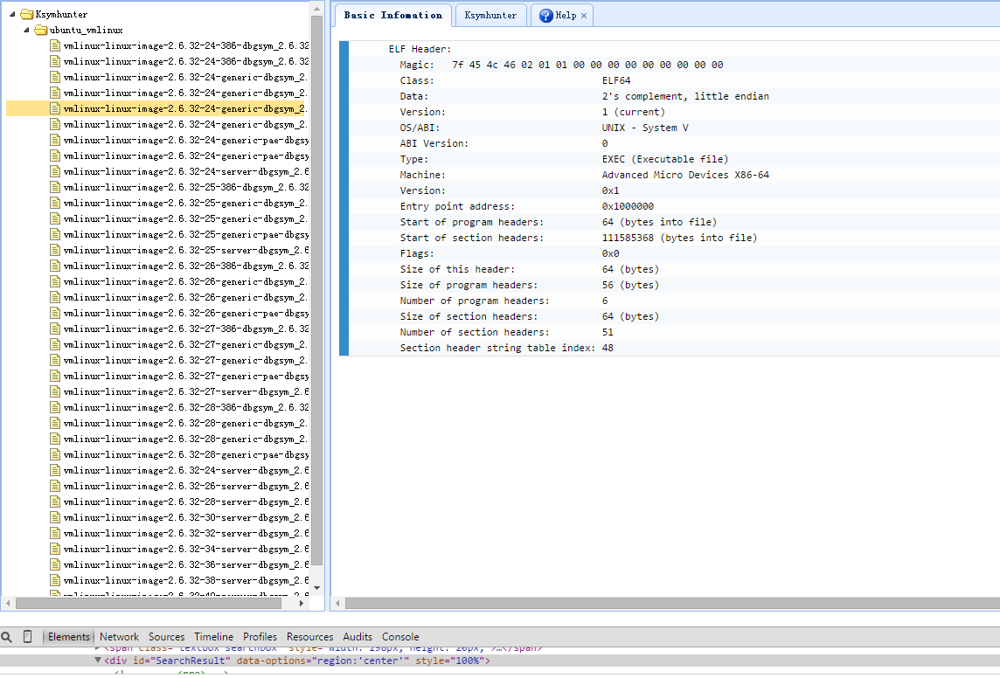
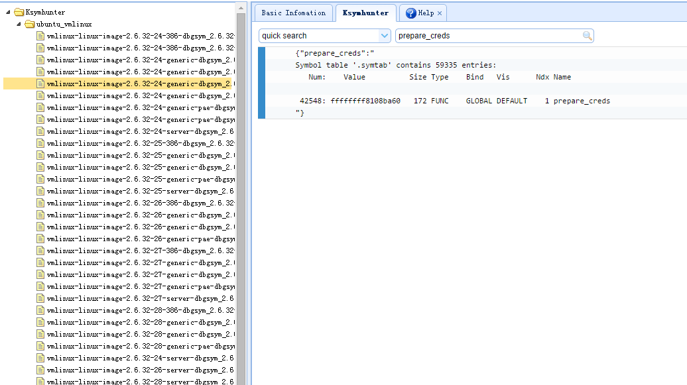
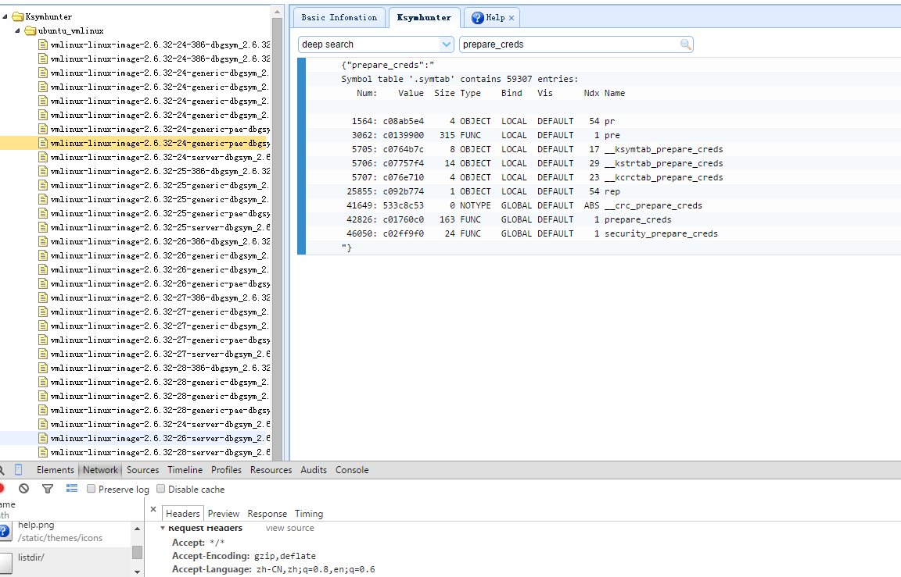

WHY THIS
====
 * 这个小玩意仅是为了 Ksymhunter 跨发行版简单 web 可视化查询
 * 仅仅是为了学习下 web 编程 ;-)
 # 用到的 vmlinux 文件
  * redhat 系列
    * ftp://ftp.redhat.com/pub/redhat/linux/enterprise/6Server/en/os/x86_64/Debuginfo/
  * ubuntu 系列
    * http://ddebs.ubuntu.com/pool/main/l/linux/
 * [PS1] 请自行下载 kernel-debuginfo 包并解压 需要解压并放置目录为 distribution/release_version/vmlinux_file
   i.e. ubuntu/10.04/vmlinux-2.6.32-42
 * [PS2] 注意修改 webui.py 中的 vmlinux 绝对路径哦

TODO
====
 Fixme
   * : searchbox 处应该加入 ajax 等待服务端返回动画         [TODO]
   * : LeftTree 中 div 布局需要调试 内 div 会出现下拉       [TODO]

 Feature
   * : 加入针对内核函数反编译器                             [TODO]
   * : 搜索框的 deepsearch 和 quicklookup 优化              [DONE]

INSTALL
====
 * pip install -r requirement
 * python webui.py

考虑用到的第三方库
====
## elf 解析器总结
 * pyelf - 没用到外部依赖 以及用到的数据都是自定义的 缺点只支持 x86 不支持 x64
 * python-elf - 没去研究啊
 * pyelftools - 自依赖 支持 x86/x64 的 littel endian    that's what i use !!!!

## 反编译器
 * pymsasid - A pure python disassembling library 2012-10-31到现在还没有更新 
   * 很多 open issues 还没有解决 [1]
 * diStorm disassembler library
 * BeaEnginePython
 * PyDasm
 * Libdisassemble
 * pwntools - disasm 函数居然是通过 odjdump 我醉了
 * libdasm - pure c disasm implement 2010 年
   * 同样有些小 issue@2014 仍未解决

Contribute
====
 感谢淘神教我写 ajax 以及各种有意思的前端技巧

Reference
====
[1] https://code.google.com/p/pymsasid/issues/detail?id=16
